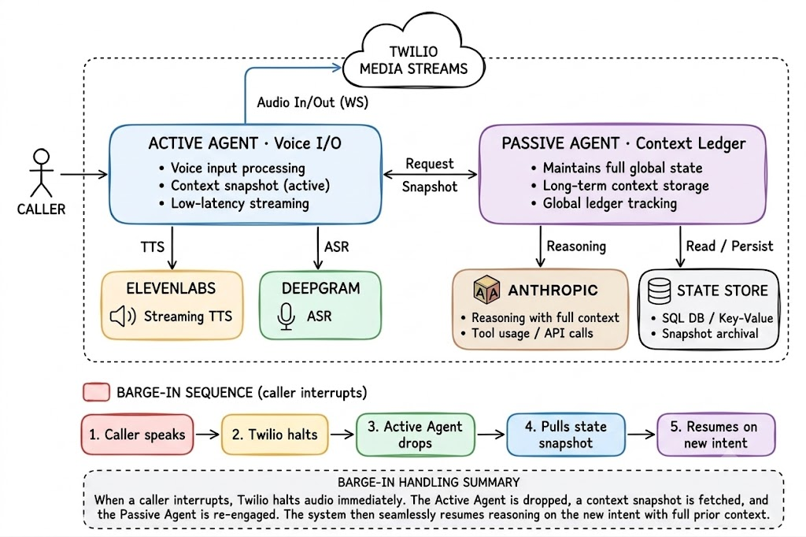
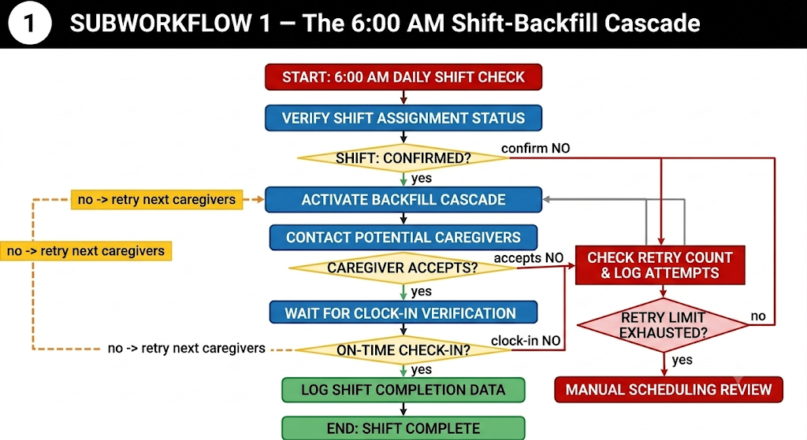
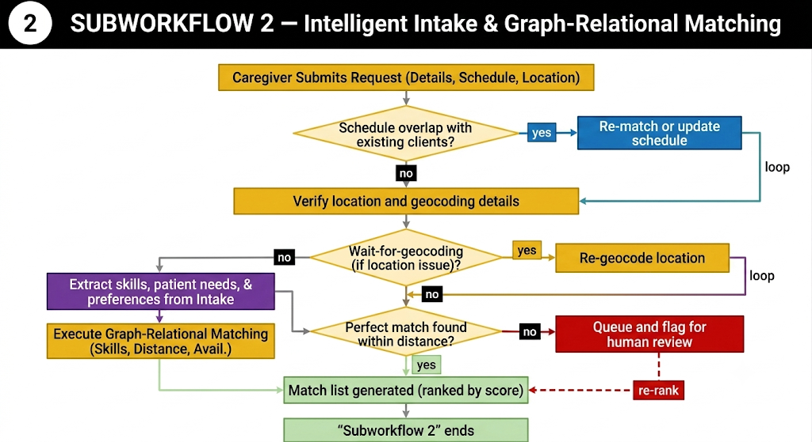
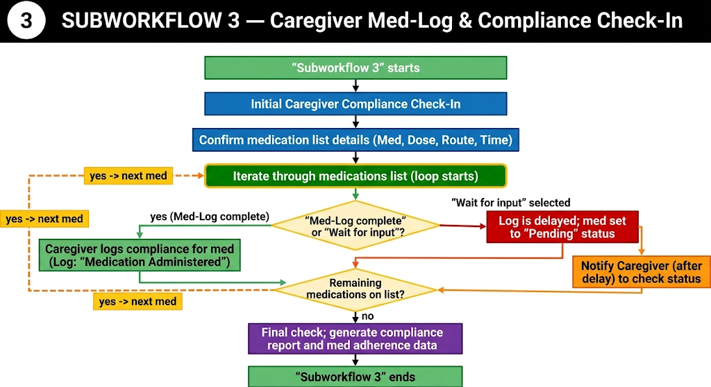
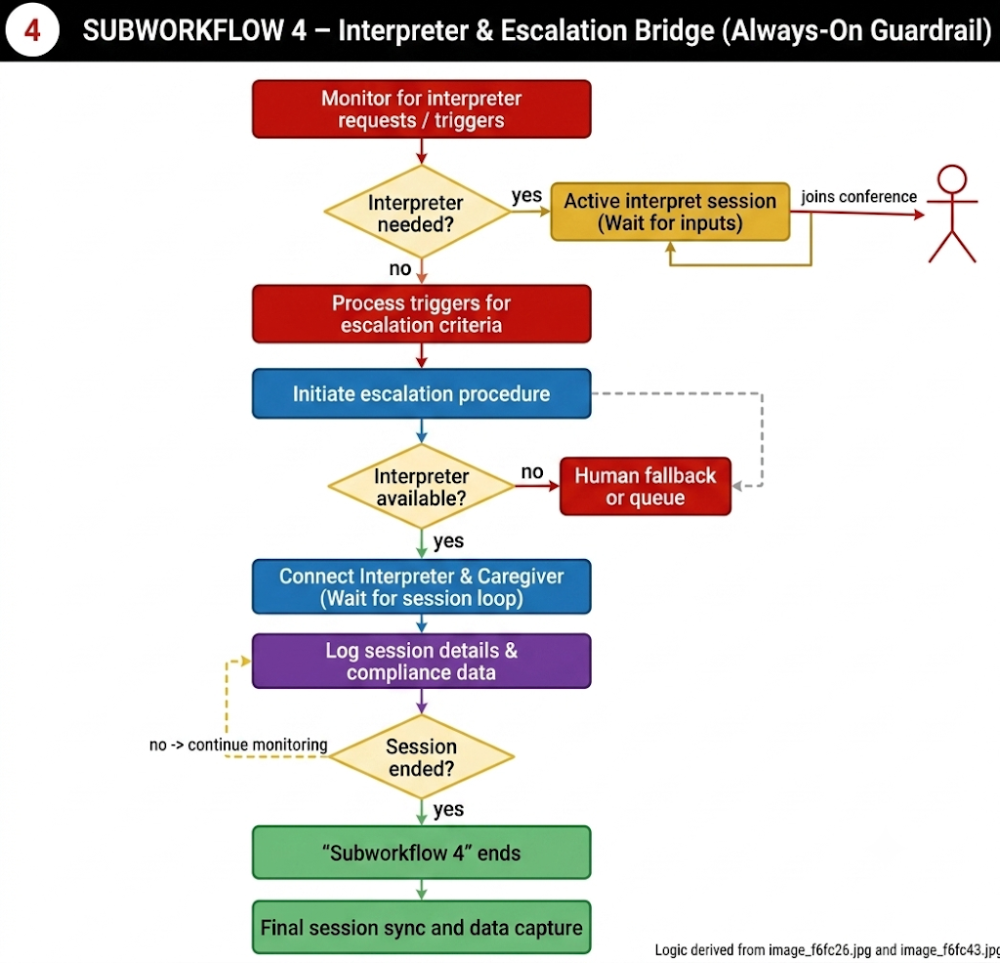

# The Healthcare Omni-Agent

**A single voice AI that answers the phone for a home health agency and runs the busy work: filling last minute shift gaps, taking in new patients and matching them to the right caregiver, logging medication at the end of a shift, and connecting people to a human in an emergency while translating in real time.**

Built for Healthcare Hack NYC.

## What this product does

Home health agencies run on the phone. A caregiver calls out sick at 6 in the morning, a family calls to sign up a new patient, a caregiver calls to close out their visit, or someone calls in a panic. Today a human coordinator handles all of this by hand, and it eats a huge part of the day.

The Healthcare Omni-Agent picks up every one of those calls. It recognizes who is calling, understands why they are calling, and then does the work: it dials backup staff to fill the open shift, it captures a new patient and finds the best caregiver match, it records which medications were given, or it bridges the call to a human and interprets between languages. It never loses its place in the conversation, even if the caller interrupts it or changes the topic halfway through.

### The problem we are solving

- Home health agencies spend roughly 27 percent of their operating budget on non clinical office work. Most of that is phone coordination.
- When a caregiver calls out, a human scheduler spends about 45 minutes dialing backups by hand. While they dial, shifts go unfilled and the agency loses billable revenue.
- Taking a new patient by hand and cross checking them against the caregiver roster is slow and easy to get wrong.
- Writing down medication logs at the end of a shift is manual paperwork, and mistakes there turn into compliance risk.
- An English speaking office struggles to talk to caregivers and patients who speak other languages, and pays outside translation services by the minute.

### What you get

- **Automatic shift backfill.** A call out at 6 AM triggers an instant cascade to available, qualified backups. The shift locks the moment someone says yes.
- **Smart intake and matching.** A new patient is captured in a structured way and matched to the right caregiver by language, certification, and how close they live.
- **Medication logging by voice.** At the end of a shift the caregiver confirms what they gave, out loud, and the system turns it into clean, audit ready records.
- **Live human handoff and interpretation.** If the agent hears distress, severe pain, or a request for a human, it pulls in a human coordinator and translates the call in both directions.
- **Never drops the thread.** Caller ID greetings, mid call topic switches, and interruptions are all handled without losing state.
- **A written record of every call** is sent to the agency staff portal the moment the call ends.

## Architecture

The full system, end to end.

The four specialized workflows in detail.

**SubWorkflow 1: The 6:00 AM Shift-Backfill Cascade**

**SubWorkflow 2: Intelligent Intake and Graph Matching**

**SubWorkflow 3: Caregiver Med-Log and Compliance Check-In**

**SubWorkflow 4: Interpreter and Escalation Bridge**

## How the whole thing works

Think of it as a hub with spokes.

At the center is the **Main Orchestrator Agent**. It is the front desk. It answers every call, figures out who is calling and why, holds the memory of the conversation, and hands the call to the right workflow. When that workflow finishes, control comes back to the center.

Around the hub are **four SubWorkflows**, each one an expert at a single job. The Orchestrator sends the call to whichever one fits. One of them, the escalation bridge, is special: it can jump in and take over at any time if it hears an emergency.

Underneath everything is a **Dual-Agent Core** that keeps the voice fast and the memory perfect at the same time, and a **Backend Data Layer** that stores the roster, the calendars, the checklists, and the audit trail.

Here is a normal call, step by step:

1. Someone calls the agency number. The call comes in through Twilio.
2. The Orchestrator answers, recognizes the phone number, greets the person by name, and detects their language.
3. It listens to the first few sentences and decides the intent. Are they calling out sick? Signing up a patient? Closing a shift? In distress?
4. It routes the call into the matching SubWorkflow.
5. The SubWorkflow does its job, reading from and writing to the data layer as needed.
6. When it finishes, control returns to the Orchestrator, which can wrap up or handle a second request on the same call.
7. The moment the call ends, a clean written summary is pushed to the staff portal.

## The building blocks

### The Main Orchestrator Agent (the router)

This is the traffic controller. It does four things well:

- Answers the Twilio call and recognizes the caller by their number, so it can greet caregivers and patients by name and pull up their profile.
- Establishes the caller's language right away and speaks it for the rest of the call.
- Detects intent and routes the call to the correct SubWorkflow.
- Holds the global state, so if the caller switches topics in the middle of a call, it can close one workflow and open another without dropping the call.

### The Dual-Agent Core (why the voice stays fast and the memory stays perfect)

A voice assistant has two competing needs. It has to respond instantly, and it has to remember everything. Doing both in one place makes it slow. So we split the job in two.

- **The Active Agent** owns the live voice. It handles the audio stream, turns speech into text and text into speech, and works with a small, fast memory so it can answer right away.
- **The Passive Agent** owns the memory. It listens in the background, writes everything to the database, and keeps the full picture of the conversation. It does this off to the side so it never slows the voice down.

**Barge-in handling.** People interrupt. When the caller talks over the agent, Twilio stops the playback, the Active Agent drops whatever it was about to say, pulls the latest snapshot of the conversation from the Passive Agent, and picks up on the new direction. Nothing that was already said gets forgotten. This is what lets someone change their mind mid sentence and still be understood.

## The features, step by step

### Feature 1: Shift-Backfill Cascade

**What starts it:** a caregiver calls to say they cannot make their shift.

**What it does:**

1. Confirms exactly which shift is being given up (which patient, what time, where).
2. Marks that shift as open and records the reason.
3. Runs a fast search for backup staff who are actually qualified for that visit, matching certification, language, and how close they live.
4. Sends out a wave of text messages and voice calls to those backups.
5. The first person to say yes gets the shift. The shift locks instantly, so two people can never be booked for the same slot. Everyone else is told it is filled.
6. Updates the calendar, writes the record, and hands control back to the Orchestrator.
7. If nobody accepts, it escalates to a human scheduler with a summary of who was contacted.

**How it plugs in:** it uses Twilio to send the texts and calls, Neo4j to find the qualified backups, and the calendar store to lock the shift.

**Why it matters:** it turns 45 minutes of frantic dialing into about 5 minutes of oversight, and protects the $150 to $300 of billable revenue that would be lost if the shift went unfilled.

### Feature 2: Intelligent Intake and Graph Matching

**What starts it:** a new patient or a family member calls to sign up.

**What it does:**

1. Walks the caller through a structured intake: care needs, required certifications, language, location, and schedule.
2. Looks up the caregiver roster and finds the best matches, weighing language, certifications, and distance.
3. Ranks the candidates and proposes a schedule.
4. Confirms the plan with the caller and writes it straight to the calendar.

**How it plugs in:** the matching runs on a Neo4j graph. Instead of a slow database join, finding a caregiver who is qualified, speaks the right language, and lives nearby is a single graph lookup. The confirmed schedule is written to the calendar store.

**Why it matters:** it removes the manual cross checking that usually slows down onboarding, so the agency can start staffing (and billing) a new patient faster.

### Feature 3: Caregiver Med-Log and Compliance Check-In

**What starts it:** a caregiver calls in to close out their shift.

**What it does:**

1. Identifies the shift and patient being closed out.
2. Loads that patient's medication plan for the day.
3. Walks through each medication and asks the caregiver to confirm, by voice, what was given and when.
4. Handles the real world cases: a dose was missed, refused, or given as needed.
5. Turns the spoken answers into clean, structured records.
6. Appends those records to an audit ready log that can never be quietly edited, only added to.

**How it plugs in:** it reads the daily plan from the task checklist store, uses the voice pipeline to run the questionnaire, and writes the final structured record to the append only audit log.

**Why it matters:** it removes end of day paperwork and produces accurate, audit ready compliance data that helps prevent regulatory fines.

### Feature 4: Interpreter and Escalation Bridge

**What starts it:** at any point during any other workflow, the agent hears distress keywords, a report of severe pain, or a direct request for a human.

**What it does:**

1. Overrides whatever workflow was running, while carefully saving its place.
2. Calls the agency's human triage coordinator right away.
3. Patches the caller and the coordinator into the same call.
4. Turns the agent into a live, two way interpreter between them.
5. Stays on until the situation is resolved, then logs the escalation and hands control back so the original task can continue if needed.

**How it plugs in:** it uses Twilio to conference the lines together, the voice pipeline to interpret in both directions, and the Passive Agent to save and restore the conversation state.

**Why it matters:** it lets an English speaking office coordinate with multilingual caregivers and patients, and it replaces outside medical translation services that charge $0.80 to $5.00 or more per minute.

### Feature 5: Personalization and everyday convenience

- **Caller ID recognition.** The incoming phone number is used to greet people by name and instantly pull up their shifts, care profile, or compliance documents.
- **Inline calendar changes.** During any call, a user can accept, confirm, or reschedule a visit just by talking.
- **Transparency summaries.** When a call ends, a structured summary is generated and sent to the staff portal, so office staff always know what happened.
- **Video validation.** If a check-in needs a visual confirmation, for example verifying a hazard in the field, the agent can text a secure video link that connects field staff to a remote supervisor.

## How the pieces integrate

Everything shares a common set of services, which is what keeps the system simple and consistent.

- **Twilio** is the phone line. It handles inbound and outbound voice, text messages, video links, and the live audio stream. It is used by the Orchestrator to answer calls, by the cascade to reach backups, and by the escalation bridge to conference in a human.
- **ElevenLabs** gives the agent its voice. It turns text into natural, low latency speech, so the conversation feels real.
- **Speech to text** turns the caller's voice into text for the agent to understand. This runs on a streaming provider so there is little delay.
- **Neo4j** is the brain of the roster. It stores caregivers, patients, certifications, languages, and locations as a connected graph, which makes matching and backfill fast.
- **Claude Opus 4.8** is the reasoning engine behind the Orchestrator and the two agents. It understands intent, drives the conversation, and calls the right tools.
- **The data layer** holds the shift calendars, the audit logs, and the daily task checklists, and serves them to every workflow through one clean interface.

The pattern is always the same. The Orchestrator answers and routes. A SubWorkflow does the work. Shared services (voice, phone, graph, storage) are called as needed. The Passive Agent records everything and produces the summary at the end.

## What keeps it reliable

- **Fast responses.** The Active Agent stays lightweight and streams audio, so the caller is not left waiting.
- **No lost state.** Interruptions and mid call topic changes are handled by the shared snapshot, so prior answers are never forgotten. If a call drops, progress can be picked back up.
- **Safe shift locking.** Two backups can accept at almost the same instant, and only the first one wins. No double booking.
- **Compliance minded.** Audit logs are add only, patient data is handled with care, and calls can carry the right consent prompts.
- **Human safety net.** When the automation cannot resolve something, it hands off to a human with the full context.

## Future roadmap

The current build is focused on the hackathon demo. The natural next steps toward a production system are:

- **Queue workers** (for example SQS or Kafka) so the outbound cascade and other async jobs scale cleanly under load.
- **Object storage** for a raw archive of call audio and transcripts.
- **A data warehouse** (for example Postgres, BigQuery, or Snowflake) for reporting and analytics across every agency and patient.
- **Distributed processing** (for example Spark or Flink) for heavier batch work.
- **Managed, always on agents** so the workflows can run as durable services rather than per call sessions.
- **Deeper integrations** with real electronic health record systems and automated verification of caregiver credentials against external registries.
- **Wider language coverage** for the interpreter bridge, and a richer staff portal for scheduling and oversight.

## Status

Draft, hackathon build. The architecture is designed to grow from a single demo line into a full agency wide platform without changing its core shape.
