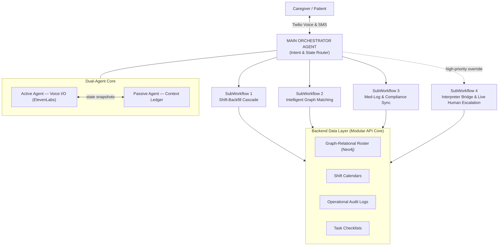

# 02 · Architecture

_Purpose: how the Orchestrator, SubWorkflows, and Dual-Agent core fit together._
_Owner: Team · Status: Draft_

The platform runs on a **hub-and-spoke** model. A single **Main Orchestrator Agent** is the
universal gateway that maintains state and routes each conversation into one of four
specialized **SubWorkflows** based on caller intent.

## System diagram

### Mermaid (renders on GitHub)



### ASCII (portable)

```
========================================================================================
 CURRENT VERSION: ORCHESTRATOR & SUBWORKFLOWS

  [ Caregiver / Patient ] <--(Twilio Voice & SMS)--> [ MAIN ORCHESTRATOR AGENT ]
                                                        (Intent & State Router)
                                                               ||
        +------------------------+------------------------+------------------------+
        |                        |                        |
        v                        v                        v
  +------------------+   +--------------------+   +------------------------+
  |  SUBWORKFLOW 1   |   |   SUBWORKFLOW 2    |   |     SUBWORKFLOW 3      |
  | Shift-Backfill   |   | Intelligent Graph  |   | Med-Log & Compliance   |
  |    Cascade       |   |     Matching       |   |        Sync            |
  +------------------+   +--------------------+   +------------------------+
        |                        |                        |
        +------------------------+------------------------+
                                 |
  +-------------------------------------------------------------------------+
  | SUBWORKFLOW 4: Interpreter Bridge & Live Human Escalation (override)     |
  +-------------------------------------------------------------------------+
                                 ||
                                 v
  +-------------------------------------------------------------------------+
  | BACKEND DATA LAYER (Modular API Core)                                   |
  |   - Graph-Relational Roster (Neo4j)      - Shift Calendars              |
  |   - Operational Audit Logs               - Task Checklists              |
  +-------------------------------------------------------------------------+
========================================================================================
```

## The Main Orchestrator Agent (the router)

- **Function:** Answers the Twilio call, recognizes the caller ID, establishes the language
  natively, and determines the primary intent of the interaction.
- **State management:** Holds the global context so that if a user switches intents mid-call,
  the Orchestrator smoothly closes one SubWorkflow and opens another **without dropping the
  call**.
- **Routing:** Maps detected intent → SubWorkflow. SubWorkflow 4 (escalation) is a
  high-priority override that can interrupt any active session. See the routing table in
  [03 · SubWorkflows](./03-subworkflows/README.md).

## The Dual-Agent core (barge-in failsafe)

Two cooperating agents split the work of a live phone conversation so the system stays fast
*and* never loses state.

### Active Agent — Voice I/O
- Handles the real-time audio stream.
- Powered by the **ElevenLabs API** for ultra-low-latency, natural voice delivery.
- Works with a **lightweight context window** to keep responses fast.

### Passive Agent — Context Ledger
- Listens to the WebSocket tokens in the background.
- Updates the central system database and maintains the **global conversation state**.

### Barge-in handling
When a caller interrupts the AI mid-sentence:
1. Twilio stops audio playback.
2. The Active Agent **drops its in-flight generation**.
3. It pulls the **latest state snapshot** from the Passive Agent.
4. It adapts to the new direction seamlessly — without forgetting previous inputs.

```
  Caller interrupts ──▶ Twilio halts playback
                           │
                           ▼
        Active Agent drops generation ──▶ pulls snapshot from Passive Agent
                                              │
                                              ▼
                                   resumes on the new intent, state intact
```

## Personalization & intelligent routing engine

- **Caller-ID recognition.** The incoming phone number greets caregivers/patients by name and
  instantly pulls their current shift assignments, compliance documents, or care profiles.
- **Calendar modification.** Users can conversationally accept, confirm, or reschedule specific
  visit slots inline during any call. → [04 · Data Model](./04-data-model.md)
- **Transparency summaries.** The moment a call ends, the Passive Agent generates a structured
  summary and sends it to the agency's staff portal.

## Video API integration layer

If an administrative check-in requires **visual validation** (e.g. verifying a field hazard),
the agent texts a **Twilio Video** link. Clicking it opens a secure video channel connecting
field staff directly to a remote agency supervisor. → [05 · Integrations](./05-integrations.md)

## Backend data layer (modular API core)

A modular API core fronts four stores; details in [04 · Data Model](./04-data-model.md):

- **Graph-Relational Roster (Neo4j)** — caregivers, patients, certifications, languages, proximity.
- **Shift Calendars** — visit slots and assignments.
- **Operational Audit Logs** — compliance-grade, append-only records.
- **Task Checklists** — per-patient daily med/care layouts.

## Open questions

- Where does the Passive Agent's state snapshot live — Neo4j, a fast cache (e.g. Redis), or both?
- Is the Orchestrator a distinct model/process from the Active Agent, or the same model in a
  different mode?
- What is the exact hand-off contract when SubWorkflow 4 overrides an active session mid-call?
